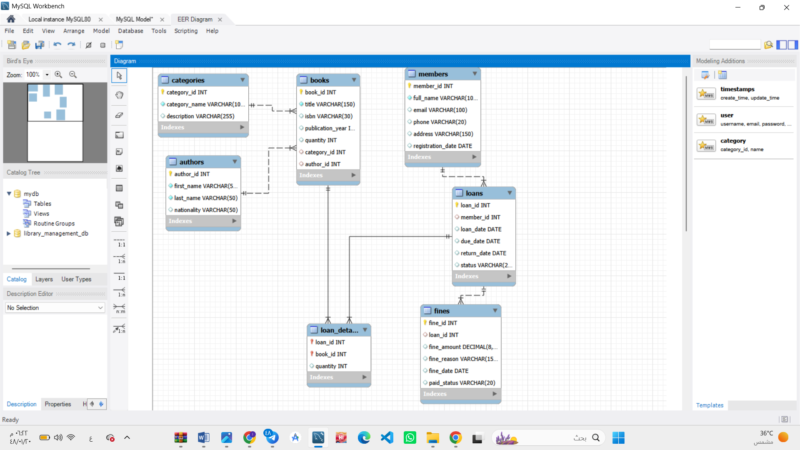

# Library Database — SQL

I built this project while learning relational databases and SQL. It models a small library with books, authors, members, loans and fines.

## Tools

SQL and MySQL. The scripts also run on MariaDB.

Use **MySQL 8.0.16 or newer**, or **MariaDB 10.2.1 or newer**, so the database enforces `CHECK` constraints. I tested the scripts with MariaDB 10.4.32.

## Database design

| Table | Stores |
| --- | --- |
| `categories` | Book categories |
| `authors` | Author names and nationalities |
| `members` | Member contact details and registration dates |
| `books` | Titles, ISBNs, publication years and inventory quantities |
| `loans` | Borrowing dates, due dates, return dates and statuses |
| `loan_details` | Books and quantities in each loan |
| `fines` | A fine record and payment status for a loan |

Each book belongs to one category and one author. Each loan belongs to one member and can contain several books. `loan_details` connects books and loans using a composite primary key. A loan can have at most one fine record.

The [EER diagram](docs/eer-diagram.png) and [analysis report](docs/library-system-analysis.pdf) are the original project documents. The SQL files define the current required fields and validation rules.

## Run the project

Open MySQL Workbench, phpMyAdmin or a MySQL/MariaDB client. Run these files **in order** on a fresh project database:

1. `sql/01_schema.sql` — creates the database and tables.
2. `sql/02_sample_data.sql` — inserts the example records; run it once.
3. `sql/03_queries.sql` — runs the 20 SQL query examples.
4. `sql/04_overdue_loans.sql` — shows unreturned loans whose due dates have passed today.

The schema does not delete an existing database. If its tables already exist, creation stops with an error. To start over intentionally, run `sql/reset_database.sql` first, then repeat steps 1–4. **The reset deletes all data in `library_management_db`.**

The sample data contains 10 categories, 10 authors, 10 members, 10 books, 12 loans, 16 loan details and 10 fine records. Names and contact details are example data. Loan statuses and fine amounts represent sample records; use the overdue query for a result based on today's date.

## What I practiced

- Primary keys, foreign keys and table relationships.
- `NOT NULL`, `UNIQUE` and `CHECK` constraints.
- `SELECT`, `WHERE`, `ORDER BY`, `LIKE` and `UNION`.
- Inner and left joins.
- Aggregates, `GROUP BY` and `HAVING`.
- String functions and date calculations.

## Data rules

- Book inventory can be zero, but cannot be negative.
- Each loan detail has a quantity greater than zero.
- Fine amounts cannot be negative.
- Due and return dates cannot come before the loan date.
- Loan statuses are `Borrowed`, `Overdue` or `Returned`.
- Returned loans have a return date; open loans do not.
- Fine payment statuses are `Paid` or `Unpaid`.

This is a database coursework project. The scripts store records and demonstrate queries; they do not automatically reduce stock or calculate fines.

## Author

Adham Muayad Hashem
